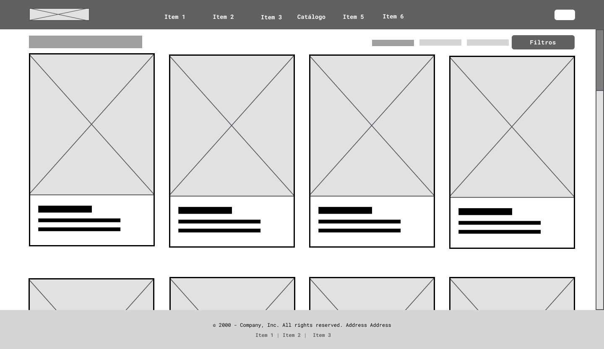
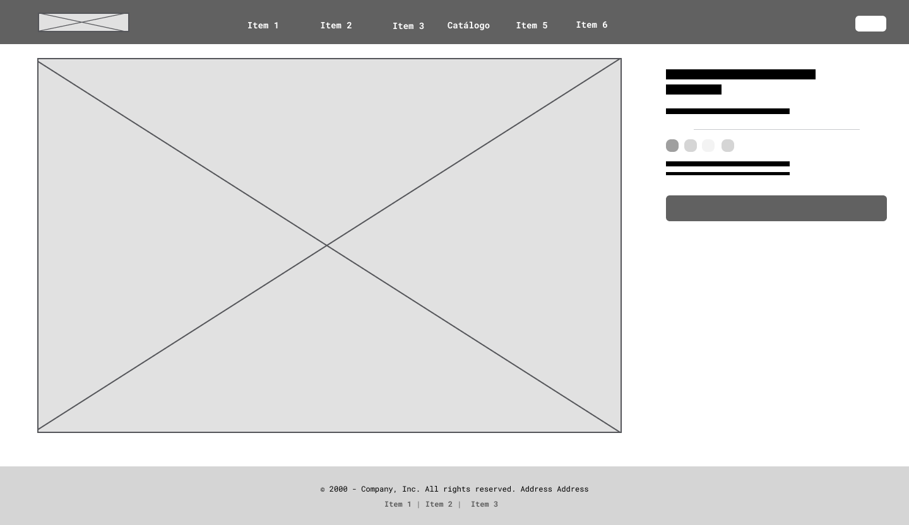

## DIU - Practica2, entregables

### Ideación 

---

#### **Hipótesis del rediseño:**

Si se añade un apartado de catálogo online con stock actualizado y filtros por talla, estilo y disponibilidad, la experiencia de usuario mejorará, facilitando la compra y reduciendo la frustración.

---

#### **Propuesta de valor:**

Mejorar la web existente añadiendo un apartado de catálogo digital conectado con el inventario físico, que permita consultar productos disponibles, filtrarlos y contactar directamente con la tienda.

### PROPUESTA DE VALOR

### TASK ANALYSIS

**Descripción breve:**  
Este flujo representa cómo el usuario accede al catálogo digital desde la página principal, selecciona una prenda y realiza una reserva online. Refleja la mejora clave en la experiencia del usuario respecto a la versión actual de la web.

**Descripción breve:**  
Mapa jerárquico del sitio web que muestra la organización de las secciones principales, incluyendo el nuevo apartado de catálogo online y sus niveles de navegación interna.

### ARQUITECTURA DE INFORMACIÓN

| Término              | Significado                                                   |
|----------------------|---------------------------------------------------------------|
| Inicio               | Página principal del sitio web                                |
| Quiénes somos        | Información sobre el proyecto y su filosofía                  |
| Sostenibilidad       | Contenido sobre prácticas responsables y economía circular    |
| Catálogo             | Sección donde se listan los productos disponibles             |
| Filtros              | Opciones para buscar por talla, tipo, color...                |
| Lista de artículos   | Resultado visual de los productos filtrados                   |
| Ficha de artículo    | Página con detalles del producto seleccionado                 |
| Reservar             | Acción para apartar un producto disponible                    |
| Contacto             | Página o botón para comunicarse con la tienda                 |

### Prototipo Lo-FI Wireframe 

Se han diseñado wireframes para **dispositivos móviles y ordenadores** simulando la estructura y navegación del nuevo apartado de catálogo online. 

Las pantallas incluyen:

#### Versión móvil:

###### Pantalla inicial
 

###### Inicio con menú desplegado
 

###### Vista general del catálogo
 

###### Filtros
 

###### Ficha de Artículo
 

#### Versión escritorio:

###### Pantalla inicial
 

###### Catálogo
 

###### Catálogo con filtros
 

###### Ficha de Artículo
 

---

**Herramienta usada:**  
Todos los wireframes se han realizado en **Figma**, utilizando el kit de componentes UI básico y ajustando elementos para representar el flujo de navegación planteado en el User Flow.

### Conclusiones  
Esta práctica me ha servido para plantear mejoras reales en la web, centradas en lo que necesitan los usuarios. Añadir un catálogo online con filtros y stock actualizado puede hacer la experiencia mucho más cómoda. Además, las herramientas como los wireframes o el user flow me han ayudado a organizar mejor las ideas y visualizar cómo sería la solución.