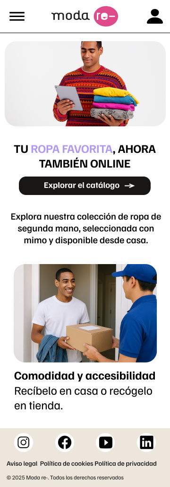
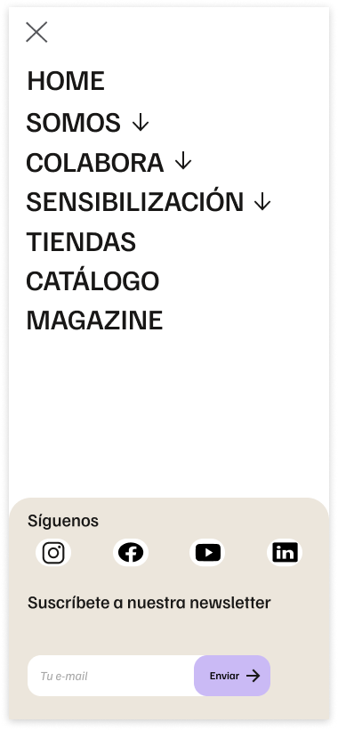

# DIU - Practica 3, entregables

- Moodboard (diseño visual + logotipo) 

#### Herramientas Utilizadas
- **Figma** → Herramienta principal para diseño visual y prototipado, usada para construir tanto el moodboard como los wireframes.
- **Capturas + edición propia de imágenes** para representar los valores y estilo de Modare (accesibilidad, sostenibilidad, economía circular).
- **Ionicons** como librería de iconos accesibles y visualmente consistentes con la estética del proyecto.

#### Contenido del Moodboard:
1. **Gama de Colores** 
    
   Paleta definida con 3 colores principales y una gama de apoyo en tonos neutros y vibrantes, con hex.

2. **Tipografía** 
    
   Fuente seleccionada: **Familjen Grotesk** (Google Fonts).  
   Se muestra su uso en diferentes pesos (Bold, Regular, Italic).

3. **Logotipo**
    
   Logotipo actual de Modare con fondo blanco.

4. **Inspiración visual** 

    

    
   Ejemplos que inspiran la estética general: moda accesible, entorno limpio, visual moderno y amigable. Apoyan el enfoque sostenible y humano del proyecto.
  
- Landing Page

 

La Landing Page presenta el nuevo apartado digital para consultar y reservar prendas de segunda mano de forma accesible y sostenible.

Este diseño **sigue las guías visuales del moodboard** e incluye los siguientes elementos destacados:

- **Hero visual principal** con mensaje claro y emocional:
  > *"Tu ropa favorita, ahora también online"*
  Acompañado de un botón CTA destacado que invita a explorar el catálogo.

- **Imagen protagonista**: representa el nuevo enfoque digital sin perder la esencia humana y cercana de Modare.

- **Beneficios destacados con iconografía visual:**
  - **Compra responsable**
  - **Selección cuidada**
  - **Comodidad y accesibilidad**

- **Estética coherente con el branding**:
  - Colores del moodboard (lavanda, negro, crema)
  - Tipografía *Familjen Grotesk*
  - Iconografía consistente (Ionicons)

- **Footer informativo** con enlaces legales y sociales

---

#### Objetivo de esta Landing

Transmitir en una sola vista:
- La propuesta de valor del catálogo online.
- La identidad visual y filosofía de Modare.
- Acceso directo al producto y al proceso de navegación del usuario.

Esta pantalla sirve como punto de entrada al sistema de reservas y filtro de prendas, y mantiene la conexión visual y emocional con la marca.

- Mockup: LAYOUT HI-FI

A continuación se presentan los **Wireframes de Alta Fidelidad (Hi-Fi)** del catálogo online para Modare, diseñados en Figma siguiendo los estilos definidos en el moodboard y respetando las decisiones tomadas en las guidelines.

Estos mockups simulan la experiencia real de usuario en un entorno móvil, mostrando la navegación principal, la consulta del catálogo, el uso de filtros y la visualización de detalles de los productos.

---

#### Versión móvil:

###### Pantalla inicial  

###### Inicio con menú desplegado  

###### Vista general del catálogo  

###### Filtros  

###### Ficha de Artículo  

###### Login  

---

**Enlace al prototipo en Figma:**  
[Ver Mockup interactivo en Figma](https://www.figma.com/proto/TddvcX5VxrWGpxht68bFAP/Wireframe?node-id=604-1116&t=NnFxuIvuUXATmZpR-1)

- Publicación del Case Study

## Conclusiones

Esta práctica ha permitido aplicar de forma realista el proceso completo de diseño de interfaces centradas en el usuario, desde la investigación inicial hasta el prototipado final. Se ha reforzado la importancia de la coherencia visual, la accesibilidad y la simplicidad en la experiencia de usuario.

El resultado es un catálogo online que respeta la filosofía de Moda re- y mejora la experiencia de compra en el entorno digital, facilitando el acceso a la moda sostenible y de segunda mano.