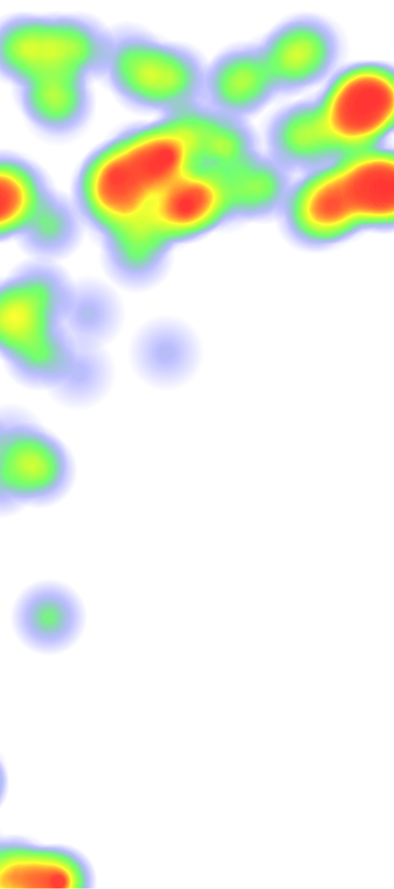
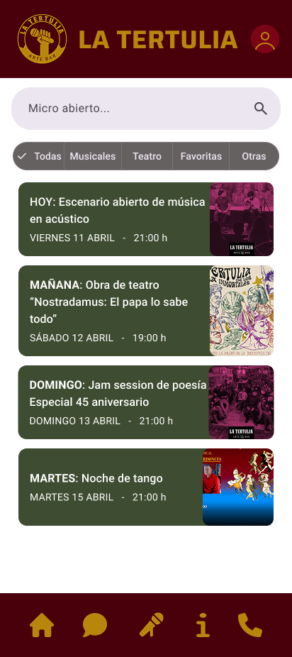
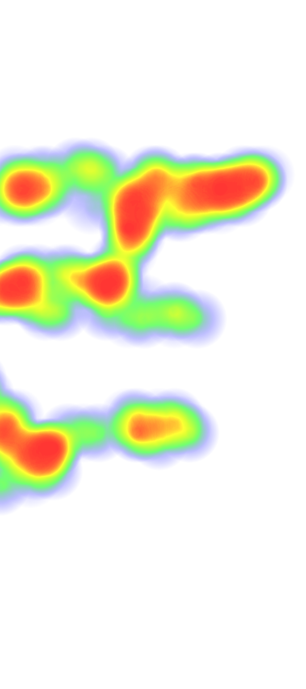
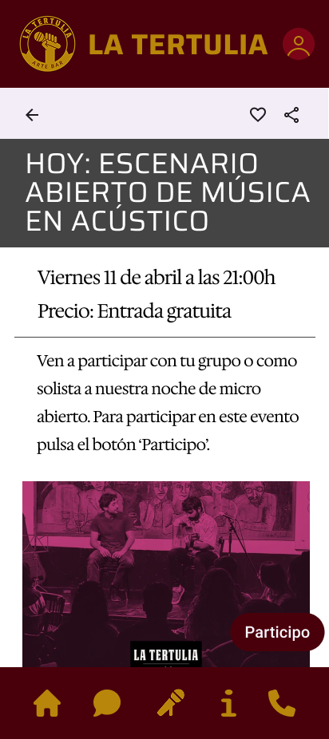
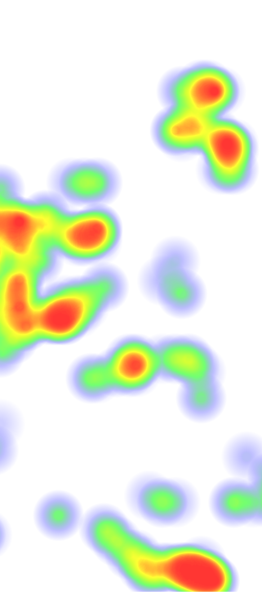
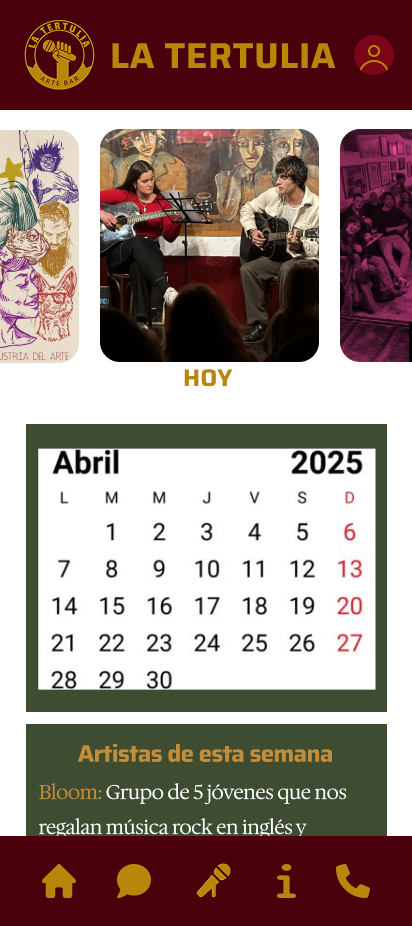

# DIU - Practica 4, entregables

>>> Se publicará la [Asignacion_ABtesting](https://github.com/mgea/DIU/blob/master/P4/Asignacion_ABtesting.pdf)
>>> Se publicará la lista de grupos y los respectivos GitHub

- Users. Elección y características de los usuarios reclutados

| Usuario     | Sexo/Edad | Ocupación   | Exp.TIC | Personalidad | Caso |
|-------------|-----------|-------------|---------|--------------|------|
| Juan Carlos | M / 23    | Estudiante  | Alta    | Introvertido | A    |
| Marta       | F / 22    | Estudiante  | Media   | Curiosa      | A    |
| Daniel      | M / 23    | Estudiante  | Alta    | Analítico    | B    |
| Juana       | F / 53    | Trabajadora | Baja    | Creativa     | B    |

- Diseño de las pruebas

1. **A/B Testing**  
   Se diseñaron 5 tareas realistas que representan escenarios de uso comunes para cada prototipo:

   - Buscar un evento (en La Tertulia) o una prenda (en Modare).
   - Marcarlo como favorito (actividad / prenda).
   - Consultar la planificación de actividades o los filtros del catálogo.
   - Realizar una reserva (evento o prenda).
   - Contactar con el local o la tienda.

2. **Cuestionario SUS**  
   Cada usuario completó el cuestionario SUS (System Usability Scale) tras la prueba, obteniendo una puntuación cuantitativa y una interpretación lingüística del nivel de usabilidad percibido.

3. **Eye Tracking (solo para Caso B)**  
   Se aplicó a “La Tertulia” usando capturas del prototipo. Se utilizaron herramientas como GazeRecorder o análisis manual para obtener insights visuales:
   - Tiempo de atención en botones clave.
   - Exploración de la página de actividades.
   - Evaluación del diseño del menú.

- Realización del Cuestionario SUS para usuarios y casos A y B.

> **Enlace a las pruebas en Maze**  
> - Prueba A (Modare): [https://t.maze.co/394030167](https://t.maze.co/394030167)  
> - Prueba B (La Tertulia): [https://t.maze.co/390470315](https://t.maze.co/390470315)

- Tabla A/B Testing con resultados para A y B

| Tarea                                           | Caso A (Modare)                           | Caso B (La Tertulia)                      |
|------------------------------------------------|-------------------------------------------|-------------------------------------------|
| 1. Buscar un elemento (prenda o evento)        | Ambos usuarios completaron la tarea sin dificultades. El buscador y los filtros fueron efectivos. | Los usuarios también localizaron fácilmente el evento. El diseño visual jerarquizado facilitó la tarea. |
| 2. Consultar la planificación de actividades o los filtros del catálogo | En Modare, Daniel entendió rápidamente el uso de los filtros y los aplicó sin dificultad. Juana también logró utilizarlos, aunque necesitó más tiempo para comprender su funcionamiento. | En La Tertulia, la planificación de actividades fue clara y accesible para ambos usuarios. El calendario y la presentación de eventos facilitaron la consulta sin fricciones. |
| 3. Realizar una reserva | Tanto Daniel como Juana completaron la reserva sin problemas.. | La reserva de evento fue sencilla para ambos perfiles, gracias a un botón claro y visible. |

- Eye Tracking para B
**Pantalla: Actividades**  
Los usuarios centraron su atención en el **buscador superior**. 
  

---

**Pantalla: Ficha de actividad**  
Se detectaron puntos de atención en el **título del evento**, el **precio** y el **botón de participación**, lo cual confirma que los elementos clave están correctamente jerarquizados.  
  

---

**Pantalla: Página principal con calendario**  
El análisis visual muestra que el **calendario** y las imágenes superiores de eventos reciben alta atención. También destaca la interacción con el **menú inferior**.  
  

- Usability Report del Caso B, con toda la información recabada del caso B
[Usability Report](Usability-Report.md)

Se dispone del Template de usability.gob (https://www.usability.gov/how-to-and-tools/resources/templates/report-template-usability-test.html) 
- Conclusiones

La práctica ha sido enriquecedora tanto a nivel técnico como metodológico. Nos ha ayudado a consolidar conocimientos sobre evaluación de usabilidad, planificación de estudios con usuarios y análisis de resultados. Creemos que estas herramientas son imprescindibles en cualquier proyecto de diseño digital centrado en las personas.

