# DIU25
Prácticas Diseño Interfaces de Usuario (Tema: .... ) 

[Guiones de prácticas](GuionesPracticas/)

Grupo: DIU3_cristiancar.  Curso: 2024/25 

Actualizado: 18/05/2025

Proyecto: 

Catálogo online para Modare

Descripción: 

Extensión de la web de Modare.org que añade un catálogo online con stock actualizado y filtros por talla, estilo o tipo de prenda. Permite a los usuarios consultar productos disponibles en tienda física, ver detalles y reservarlos fácilmente desde casa.

Miembros:
 * :bust_in_silhouette:  [Cristian Cárdenas García](https://github.com/Cristiancar22)

----- 

# Proceso de Diseño 

 

## Paso 1. UX User & Desk Research & Analisis 

### 1.a User Research Plan
 
-----

La moda de segunda mano ha crecido significativamente en los últimos años debido a una mayor conciencia ambiental y el interés en el consumo responsable. **Modare.org** es una plataforma que promueve la compra de ropa reutilizada como alternativa sostenible y asequible frente a la moda rápida (*fast fashion*). 

#### **Selección de usuarios**  
Para esta investigación, se consideran dos perfiles de usuarios clave:

1. **Jóvenes adultos (18-35 años)**  
   - Interesados en la moda asequible y sostenible.  
   - Acostumbrados a comprar ropa online y a utilizar redes sociales para descubrir tendencias.  
   - Buscan prendas únicas y estilos diferenciados.  

2. **Personas comprometidas con la sostenibilidad**  
   - Prioritizan la reducción de su huella ecológica en su consumo.  
   - Pueden no estar familiarizados con la compra de moda online, lo que puede generar barreras en la experiencia de usuario.  
   - Buscan opciones de comercio justo y economía circular.  

Estos perfiles permiten centrar el análisis en sus necesidades, expectativas y posibles dificultades al interactuar con la plataforma.  

### 1.b Competitive Analysis
 
-----

En esta sección se analizan dos plataformas de moda de segunda mano con el objetivo de comparar sus características y evaluar su impacto en la experiencia del usuario. Se ha seleccionado **Modare.org** como caso de estudio para el análisis de usabilidad.

| **Plataforma**     | **Descripción** | **Puntos Fuertes** | **Puntos Débiles** |
|--------------------|----------------|-------------------|------------------|
| **Vinted** ([vinted.es](https://www.vinted.es)) | Plataforma global para la compra y venta de ropa de segunda mano entre particulares. | - Gran comunidad de usuarios.  - Interfaz intuitiva y optimizada.  - Filtros avanzados para búsqueda de prendas. | - Enfocada en transacciones entre particulares, no tanto en comercio local.  - Comisión en las compras. |
| **Micolet** ([micolet.com](https://www.micolet.com)) | Tienda online especializada en moda de segunda mano con prendas revisadas y certificadas. | - Garantía de calidad en productos.  - Proceso de compra simplificado.  - Promueve el consumo sostenible. | - Menor flexibilidad en precios comparado con plataformas P2P.  - Oferta limitada en comparación con Vinted. |

#### **Selección de Modare.org**  
Se ha decidido analizar **Modare.org** porque se enfoca en la moda sostenible con un enfoque local en Granada. A diferencia de plataformas más globales como Vinted, Modare.org promueve un modelo basado en la economía circular dentro de una comunidad específica, lo que representa una oportunidad única para analizar la experiencia del usuario en este tipo de iniciativas. 

El estudio se centrará en evaluar la facilidad de uso del sitio web, la claridad en la presentación de productos y la efectividad del proceso de compra.

### 1.c Personas
 
-----

#### **Persona 1: Laura Gómez**  
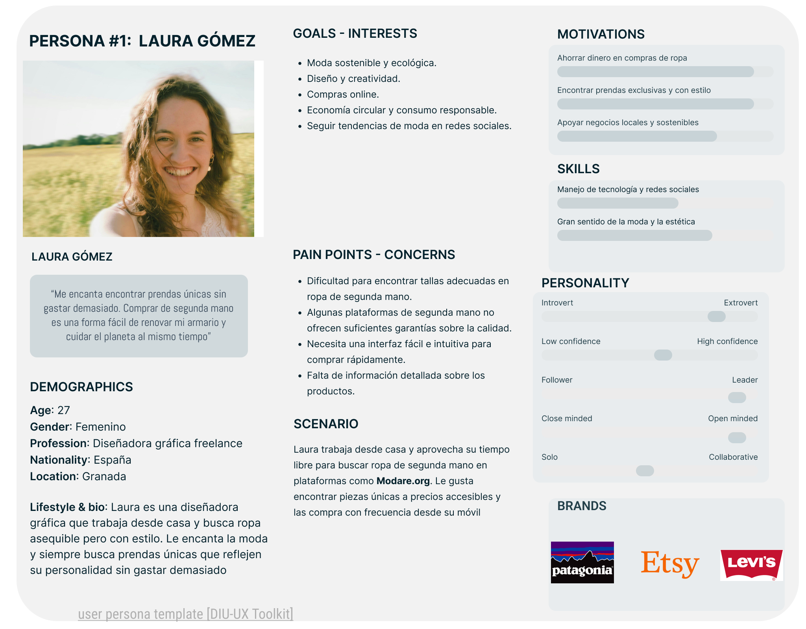  

**Descripción:**  
Laura es una diseñadora gráfica de 27 años que trabaja como freelance desde casa en Granada. Le apasiona la moda, pero también le preocupa el impacto ambiental de la industria textil. Para ella, comprar ropa de segunda mano es una forma de ahorrar dinero y al mismo tiempo apoyar el consumo responsable. Su estilo es creativo y variado, por lo que siempre busca prendas únicas que la hagan destacar.  

**Cita:**  
*"Me encanta encontrar prendas únicas sin gastar demasiado. Comprar de segunda mano es una forma fácil de renovar mi armario y cuidar el planeta al mismo tiempo."*  

---

#### **Persona 2: Antonio Ruiz**  
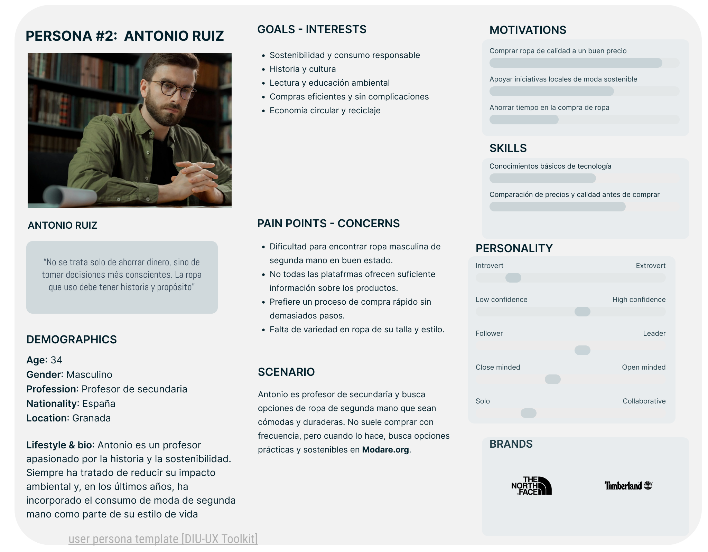  

**Descripción:**  
Antonio tiene 34 años y es profesor de secundaria en Granada. Siempre ha sido consciente del impacto ambiental de sus hábitos de consumo y prefiere comprar ropa de segunda mano antes que contribuir a la moda rápida. No le interesa seguir tendencias, pero valora la calidad y la durabilidad de las prendas. Busca opciones cómodas y funcionales para su trabajo y su día a día, priorizando la facilidad de compra y la sostenibilidad.  

**Cita:**  
*"No se trata solo de ahorrar dinero, sino de tomar decisiones más conscientes. La ropa que uso debe tener historia y propósito."*  

### 1.d User Journey Map
 
----

#### **Experiencia de Usuario - Laura Gómez**
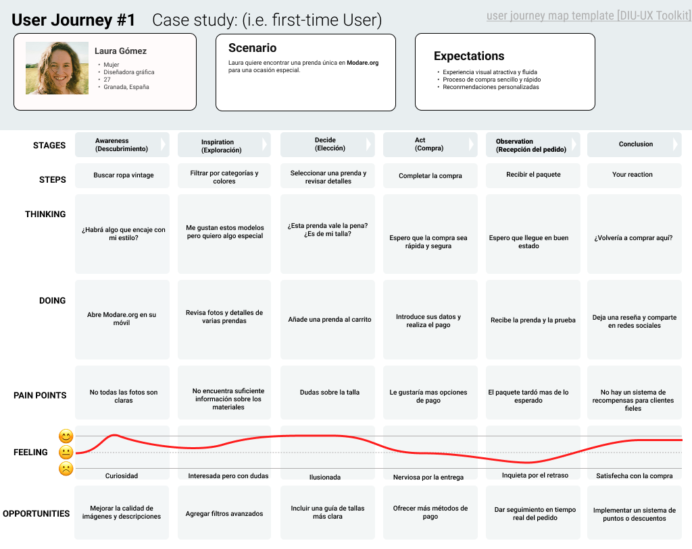  

Laura valora la moda sostenible y busca prendas únicas con facilidad. Su experiencia en Modare.org se centra en su visita a una tienda física, donde esperaba encontrar ropa bien organizada y accesible. Sin embargo, se enfrenta a un desorden generalizado, lo que dificulta la búsqueda de prendas que realmente se ajusten a su estilo y talla. Durante su recorrido, se da cuenta de que un catálogo digital ayudaría a mejorar su experiencia, permitiéndole explorar opciones antes de visitar la tienda.

**¿Es una experiencia habitual?**  
Sí, muchas personas que visitan tiendas de segunda mano pueden sentirse frustradas por la falta de organización y la dificultad para encontrar lo que buscan. La ausencia de un catálogo online impide a los clientes planificar su compra, lo que podría disuadirlos de regresar. Implementar una plataforma digital con consulta de stock en tienda y mejorar la señalización física ayudaría a optimizar la experiencia del usuario. 

---

#### **Experiencia de Usuario - Antonio Ruiz**  
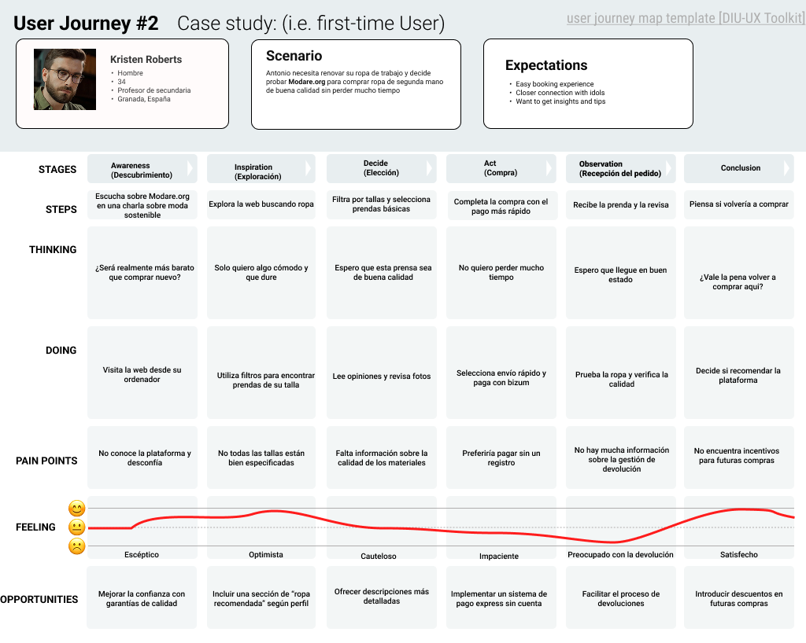  

Antonio descubrió Modare.org en una tienda física y vio una chaqueta que le interesaba, pero no pudo comprarla en ese momento. Más tarde, intentó encontrarla en la web para revisar detalles y verificar su disponibilidad, pero se llevó la sorpresa de que Modare.org no ofrece un catálogo online ni venta por internet. Esto le generó frustración, ya que no tenía forma de saber si la prenda seguía disponible sin volver físicamente a la tienda.

**¿Es una experiencia habitual?**  
Sí, muchos clientes esperan poder consultar productos online después de verlos en una tienda física, especialmente en el sector de la moda. La falta de digitalización en Modare.org dificulta la toma de decisiones y puede hacer que los usuarios busquen alternativas en otras plataformas con opciones más accesibles. La implementación de un catálogo digital con disponibilidad en tienda permitiría a los clientes planificar mejor sus compras y mejorar la experiencia general

### 1.e Usability Review
 
----
#### **Evaluación de Usabilidad de Modare.org**  

- **Enlace al documento:** [UsabilityReview.xlsx](P1/UsabilityReview.xlsx)  
- **URL Evaluada:** [Modare.org](https://modare.org/)  
- **Valoración numérica obtenida:** **73/100** → **Good**  

#### **Puntos Fuertes:**  
- **Diseño limpio y organizado** que facilita la navegación en la página principal.  
- **Información clara sobre la misión y valores** de la plataforma, promoviendo la moda sostenible.  
- **Acceso fácil a información sobre reciclaje y sostenibilidad**, lo que refuerza su impacto positivo.  

#### **Puntos Débiles:**  
- **No hay catálogo online ni consulta de stock**, lo que limita la experiencia del usuario.  
- **Falta de filtros de búsqueda o categorización**, dificultando encontrar productos específicos.  
- **Escasa interacción con los clientes** y sin una vía rápida de contacto o atención al usuario.  

#### **Comentario General:**  
La web de **Modare.org** cumple con su función informativa sobre moda sostenible, pero presenta **deficiencias en usabilidad para la compra de productos**. La ausencia de un catálogo online y la falta de herramientas de búsqueda limitan la experiencia del usuario. Para mejorar, sería recomendable **digitalizar el inventario** y proporcionar un sistema de **búsqueda de productos** en la tienda física.  

## Paso 2. UX Design  

### 2.a Reframing / IDEACION: Feedback Capture Grid / EMpathy map 
 
----

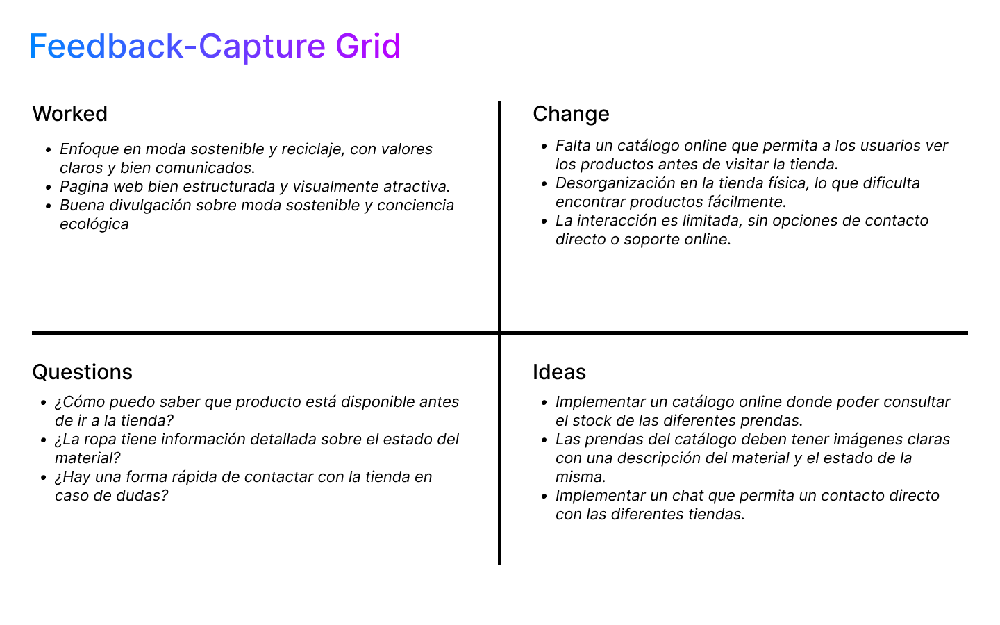

---

#### **Hipótesis del rediseño:**

Si se añade un apartado de catálogo online con stock actualizado y filtros por talla, estilo y disponibilidad, la experiencia de usuario mejorará, facilitando la compra y reduciendo la frustración.

---

#### **Propuesta de valor:**

Mejorar la web existente añadiendo un apartado de catálogo digital conectado con el inventario físico, que permita consultar productos disponibles, filtrarlos y contactar directamente con la tienda.

### 2.b ScopeCanvas

----

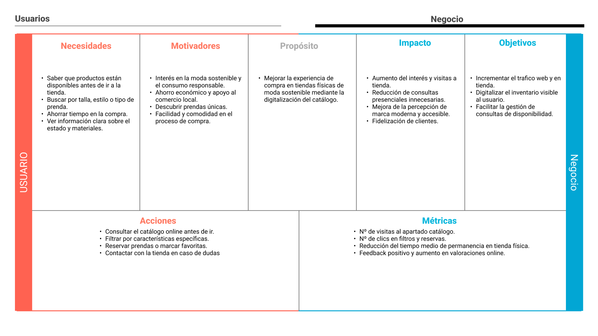

### 2.b User Flow (task) analysis 
 
-----

**Descripción breve:**  
Este flujo representa cómo el usuario accede al catálogo digital desde la página principal, selecciona una prenda y realiza una reserva online. Refleja la mejora clave en la experiencia del usuario respecto a la versión actual de la web.

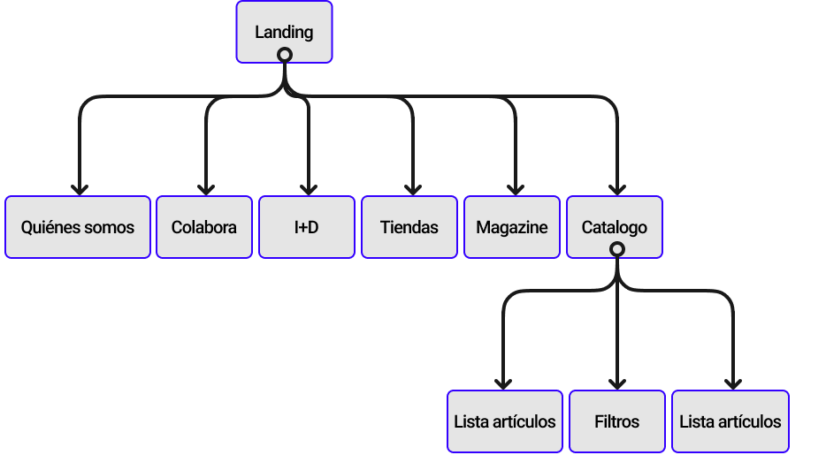

**Descripción breve:**  
Mapa jerárquico del sitio web que muestra la organización de las secciones principales, incluyendo el nuevo apartado de catálogo online y sus niveles de navegación interna.

### 2.c IA: Sitemap + Labelling 
 
----

#### Tabla de etiquetado de la interfaz

| Término              | Significado                                                   |
|----------------------|---------------------------------------------------------------|
| Inicio               | Página principal del sitio web                                |
| Quiénes somos        | Información sobre el proyecto y su filosofía                  |
| Sostenibilidad       | Contenido sobre prácticas responsables y economía circular    |
| Catálogo             | Sección donde se listan los productos disponibles             |
| Filtros              | Opciones para buscar por talla, tipo, color...                |
| Lista de artículos   | Resultado visual de los productos filtrados                   |
| Ficha de artículo    | Página con detalles del producto seleccionado                 |
| Reservar             | Acción para apartar un producto disponible                    |
| Contacto             | Página o botón para comunicarse con la tienda                 |

### 2.d Wireframes
 
-----

Se han diseñado wireframes para **dispositivos móviles y ordenadores** simulando la estructura y navegación del nuevo apartado de catálogo online. 

Las pantallas incluyen:

#### Versión móvil:

###### Pantalla inicial
 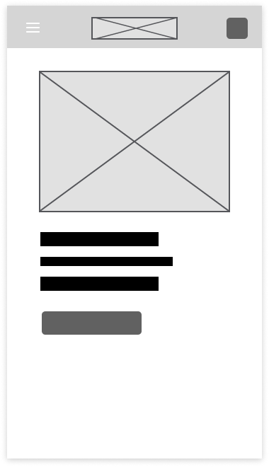

###### Inicio con menú desplegado
 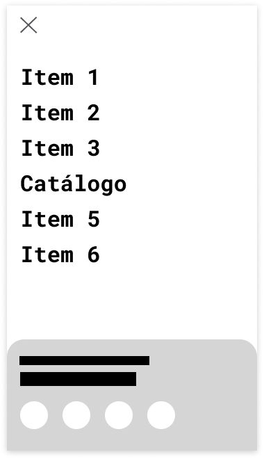

###### Vista general del catálogo
 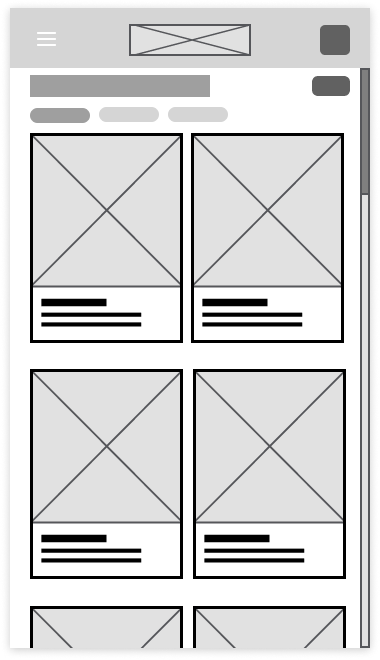

###### Filtros
 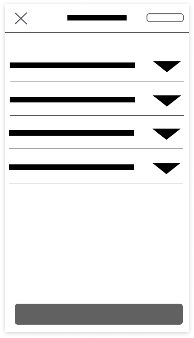

###### Ficha de Artículo
 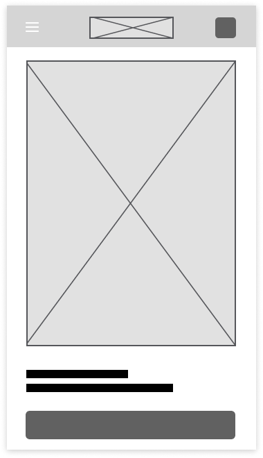

###### Login
 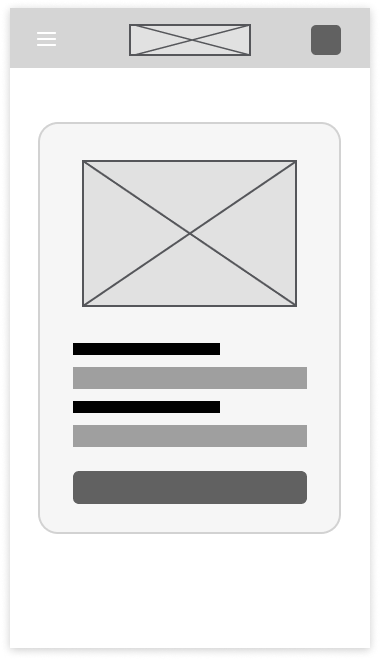

#### Versión escritorio:

###### Pantalla inicial
 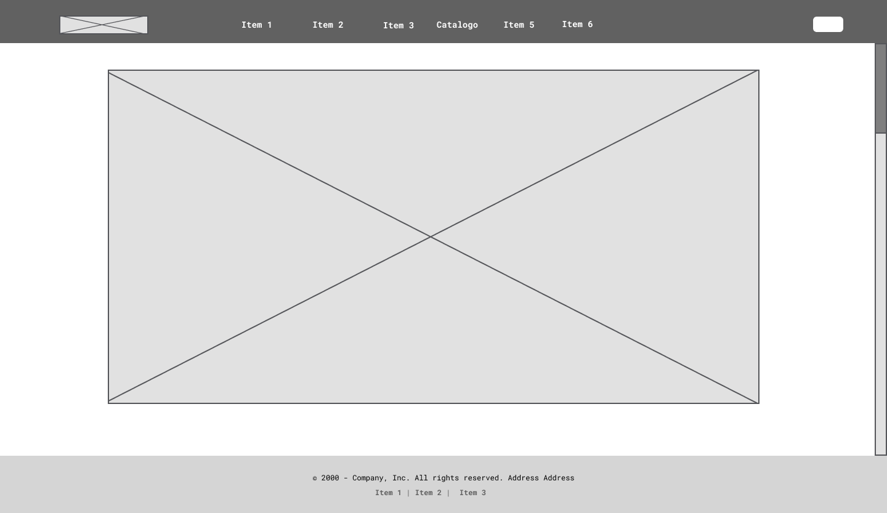

###### Catálogo
 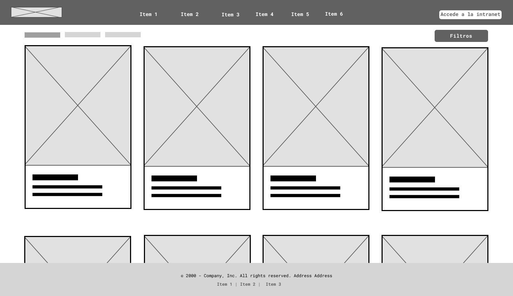

###### Catálogo con filtros
 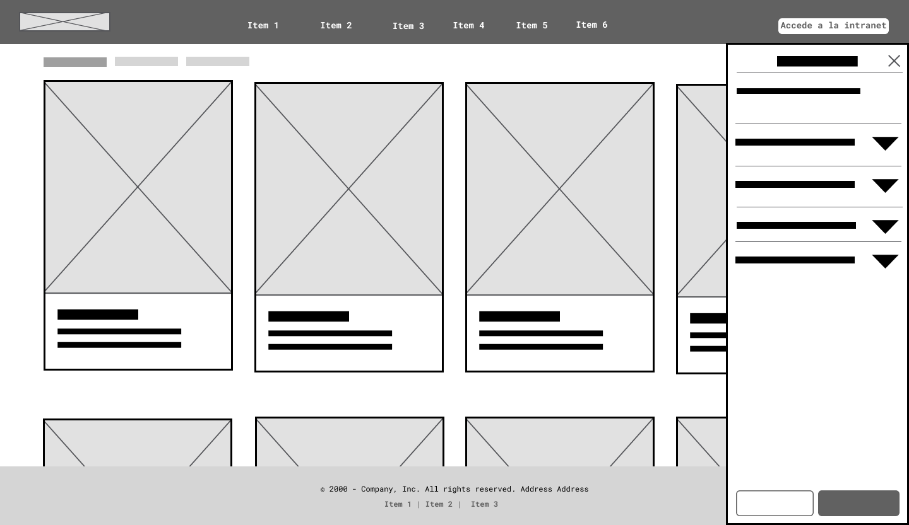

###### Ficha de Artículo
 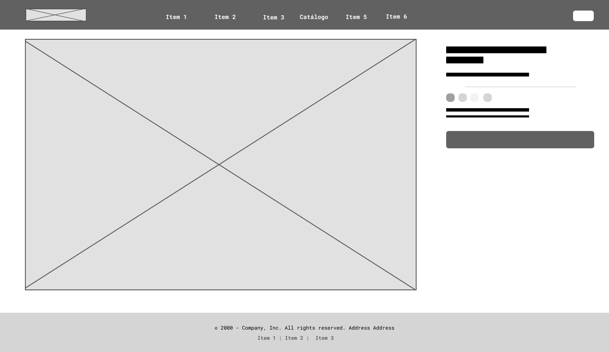

###### Login
 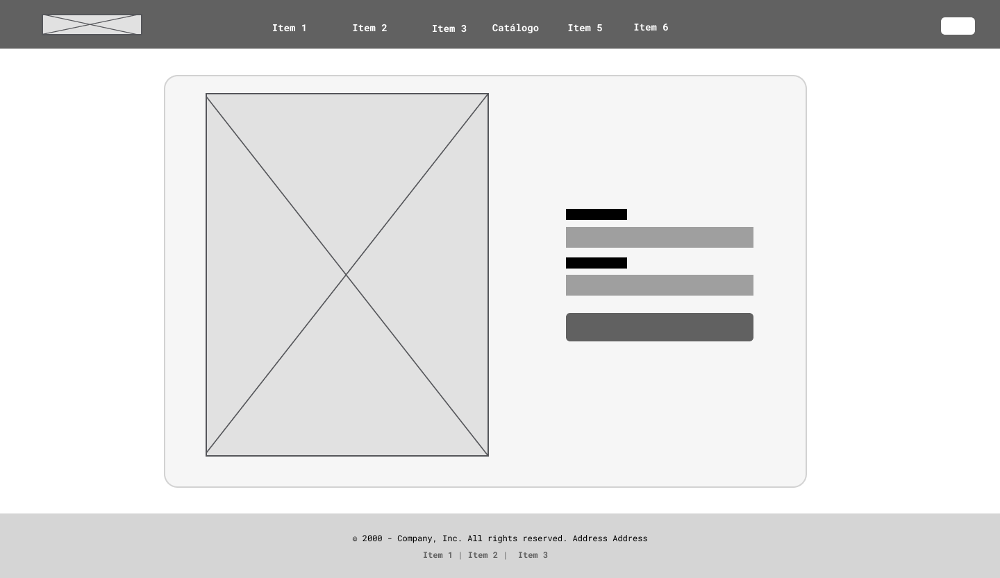

---

**Herramienta usada:**  
Todos los wireframes se han realizado en **Figma**, utilizando el kit de componentes UI básico y ajustando elementos para representar el flujo de navegación planteado en el User Flow.

 

**Prototipos interactivos:**  
- 💻 [Versión PC](https://www.figma.com/proto/TddvcX5VxrWGpxht68bFAP/Wireframe?node-id=575-1412&t=ZXvbFVGc0bCY3gkA-1)
- 📱 [Versión móvil](https://www.figma.com/proto/TddvcX5VxrWGpxht68bFAP/Wireframe?node-id=577-1743&t=ZXvbFVGc0bCY3gkA-1)

## Paso 3. Mi UX-Case Study (diseño)

### 3.a Moodboard

-----

#### Herramientas Utilizadas
- **Figma** → Herramienta principal para diseño visual y prototipado, usada para construir tanto el moodboard como los wireframes.
- **Capturas + edición propia de imágenes** para representar los valores y estilo de Modare (accesibilidad, sostenibilidad, economía circular).
- **Ionicons** como librería de iconos accesibles y visualmente consistentes con la estética del proyecto.

#### Contenido del Moodboard:
1. **Gama de Colores** 
   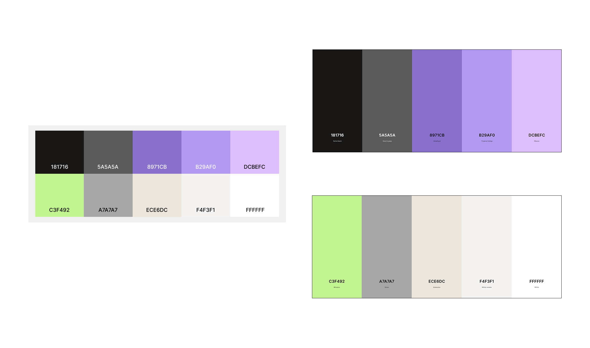 
   Paleta definida con 3 colores principales y una gama de apoyo en tonos neutros y vibrantes, con hex.

2. **Tipografía** 
   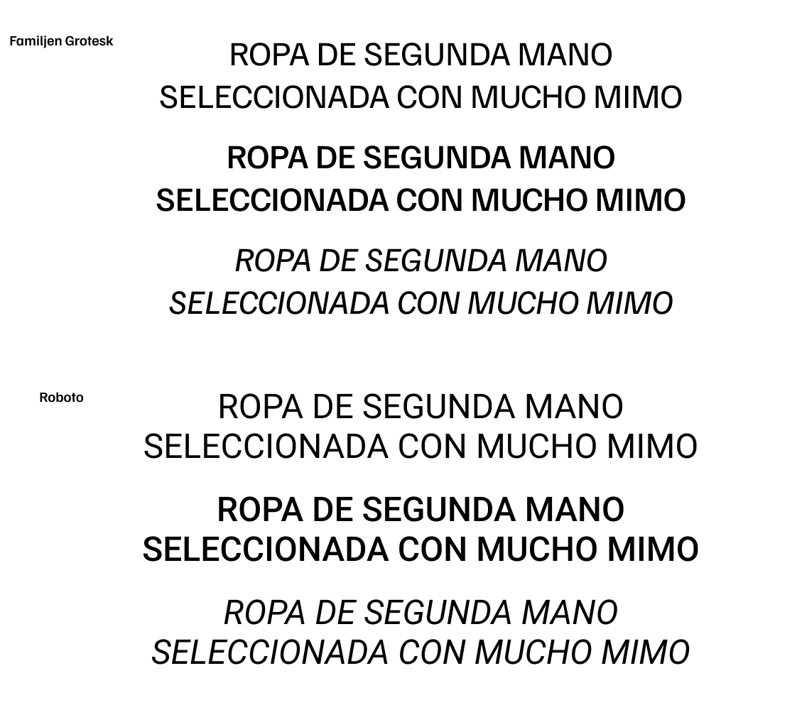 
   Fuente seleccionada: **Familjen Grotesk** (Google Fonts).  
   Se muestra su uso en diferentes pesos (Bold, Regular, Italic).

3. **Logotipo**
   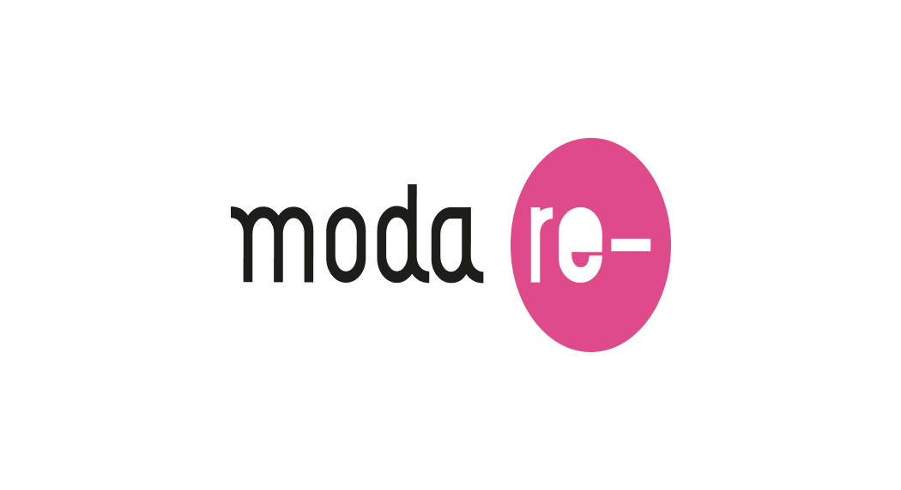 
   Logotipo actual de Modare con fondo blanco.

4. **Inspiración visual** 

   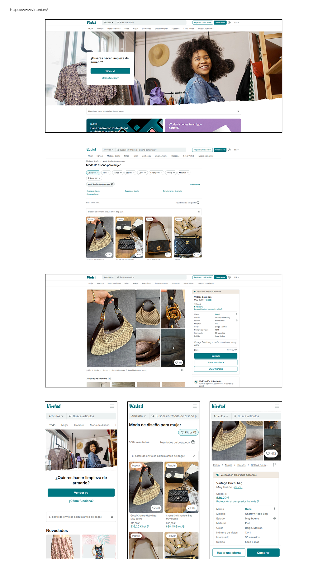 

   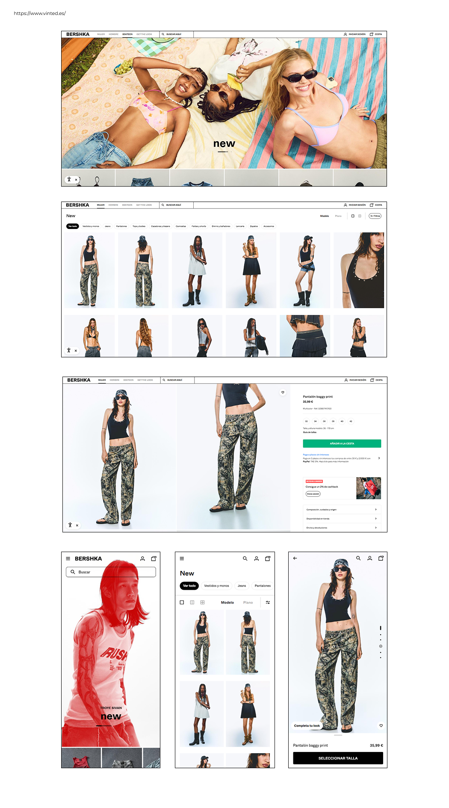 
   Ejemplos que inspiran la estética general: moda accesible, entorno limpio, visual moderno y amigable. Apoyan el enfoque sostenible y humano del proyecto.

---
### 3.b Landing Page
 
---

#### Diseño de la página de inicio del catálogo online

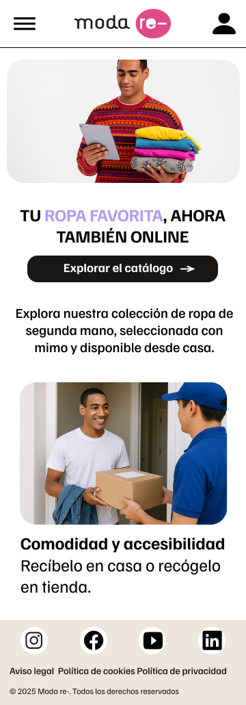 

La Landing Page presenta el nuevo apartado digital para consultar y reservar prendas de segunda mano de forma accesible y sostenible.

Este diseño **sigue las guías visuales del moodboard** e incluye los siguientes elementos destacados:

- **Hero visual principal** con mensaje claro y emocional:
  > *"Tu ropa favorita, ahora también online"*
  Acompañado de un botón CTA destacado que invita a explorar el catálogo.

- **Imagen protagonista**: representa el nuevo enfoque digital sin perder la esencia humana y cercana de Modare.

- **Beneficios destacados con iconografía visual:**
  - **Compra responsable**
  - **Selección cuidada**
  - **Comodidad y accesibilidad**

- **Estética coherente con el branding**:
  - Colores del moodboard (lavanda, negro, crema)
  - Tipografía *Familjen Grotesk*
  - Iconografía consistente (Ionicons)

- **Footer informativo** con enlaces legales y sociales

---

#### Objetivo de esta Landing

Transmitir en una sola vista:
- La propuesta de valor del catálogo online.
- La identidad visual y filosofía de Modare.
- Acceso directo al producto y al proceso de navegación del usuario.

Esta pantalla sirve como punto de entrada al sistema de reservas y filtro de prendas, y mantiene la conexión visual y emocional con la marca.

---
### 3.c Guidelines
 
----
> Estudio de Guidelines y explicación de los Patrones IU a usar.  

Se han definido los patrones de interfaz y elementos visuales clave para mantener coherencia y consistencia en la interfaz del catálogo online de Moda re-. A continuación, se presentan los principales componentes y decisiones:

---

#### 01. Paleta de colores  
Define los colores principales, secundarios y de fondo usados en toda la interfaz.  

---

#### 02. Tipografía  
Uso de la fuente **Familjen Grotesk**, en distintos pesos y tamaños para encabezados, texto regular y botones.  
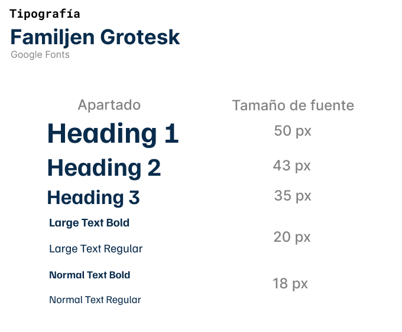

---

#### 03. Iconografía  
Uso del set de iconos **Ionicons** para navegación, acciones y redes sociales.  
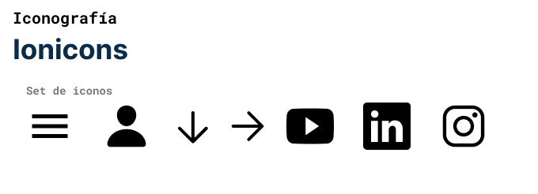

---

#### 04. Menú  
Menú hamburguesa con despliegue de pantalla completa en versión móvil.  
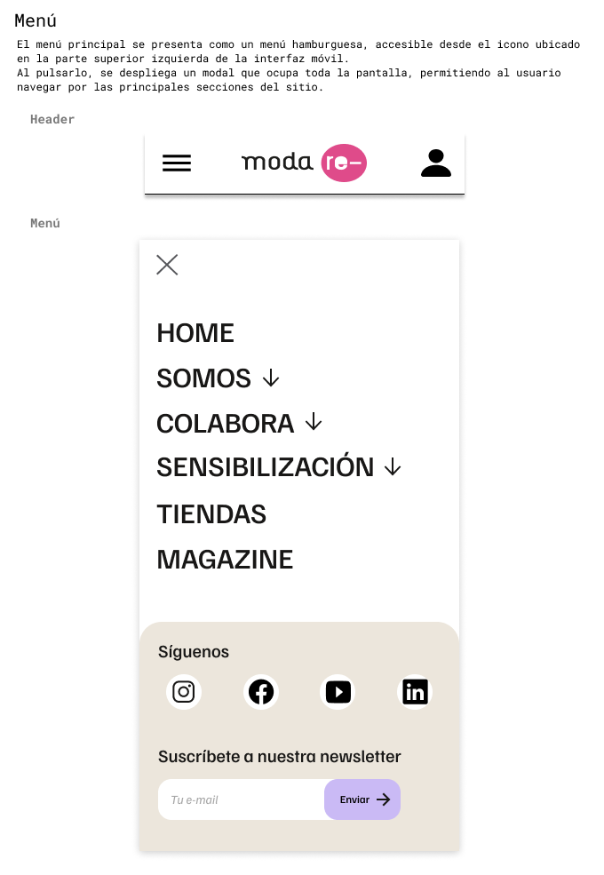

---

#### 05. Hero + Carousel  
Componente de entrada visual destacado + carrusel informativo con beneficios del servicio.  
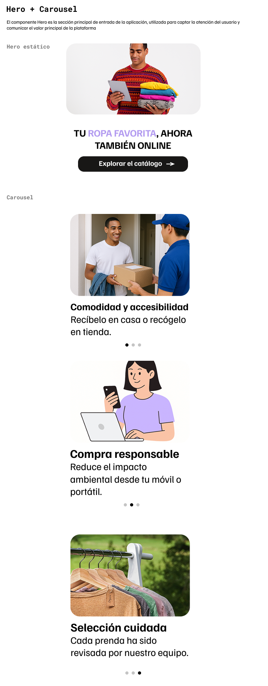

---

#### 06. Buscador  
Input con placeholder e icono de búsqueda, incluye estados de hover y focus.  
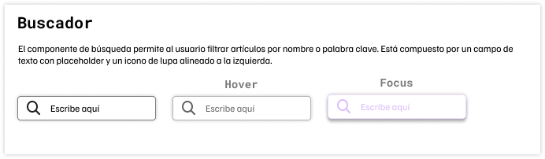

---

#### 07. Lista de artículos  
Componente que presenta las tarjetas de producto en una rejilla de 2 columnas en móvil.  
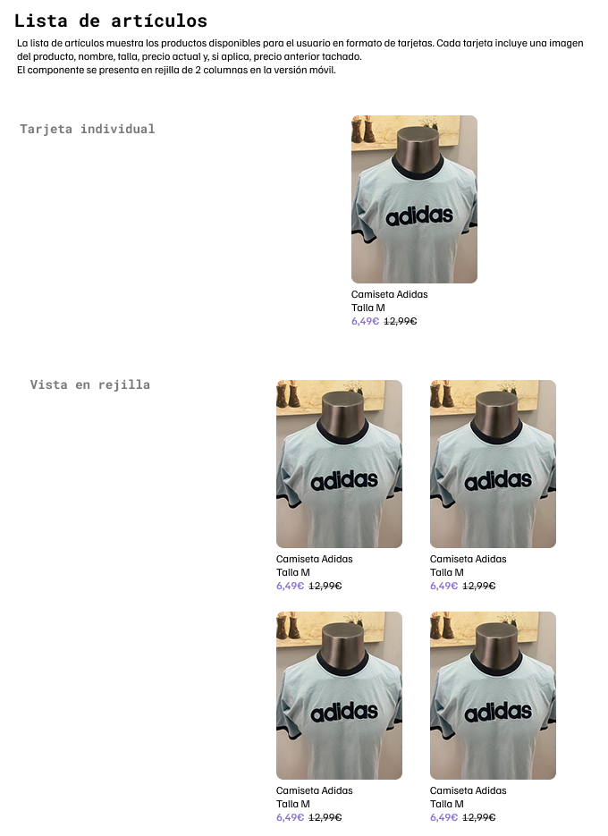

---

#### 08. Botones  
Dos variantes principales (Tipo 1 y Tipo 2), con estados hover y desactivado.  
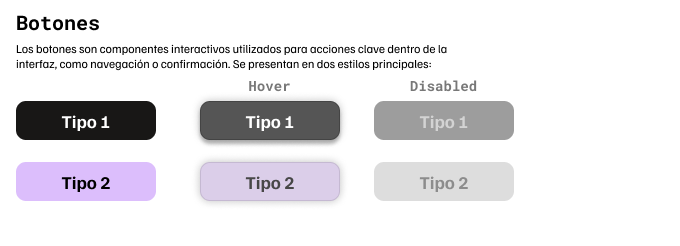

---

#### 09. Tags / Filtros  
Etiquetas utilizadas como filtros por categoría. Estados: seleccionado y no seleccionado.  
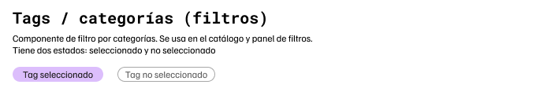

### 3.d Mockup
 
----

A continuación se presentan los **Wireframes de Alta Fidelidad (Hi-Fi)** del catálogo online para Modare, diseñados en Figma siguiendo los estilos definidos en el moodboard y respetando las decisiones tomadas en las guidelines.

Estos mockups simulan la experiencia real de usuario en un entorno móvil, mostrando la navegación principal, la consulta del catálogo, el uso de filtros y la visualización de detalles de los productos.

---

#### Versión móvil:

###### Pantalla inicial  

###### Inicio con menú desplegado  
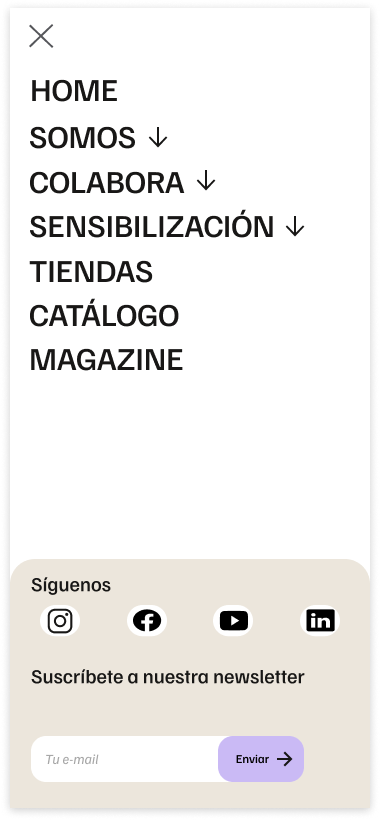

###### Vista general del catálogo  
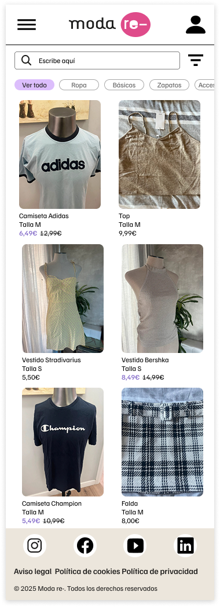

###### Filtros  
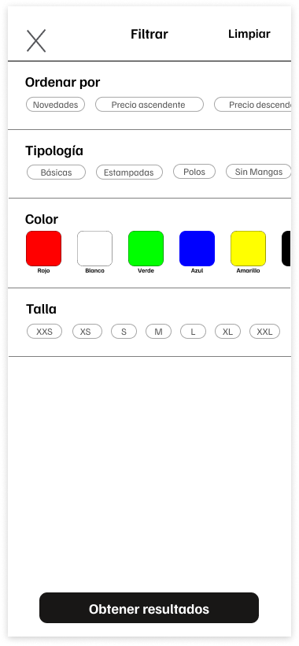

###### Ficha de Artículo  
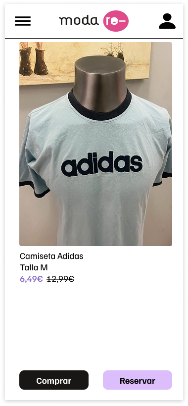

###### Login  
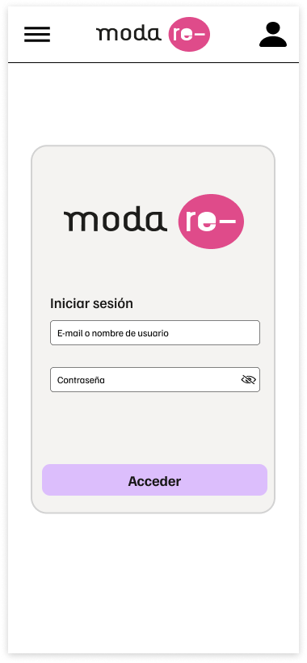

---

**Enlace al prototipo en Figma:**  
[Ver Mockup interactivo en Figma](https://www.figma.com/proto/TddvcX5VxrWGpxht68bFAP/Wireframe?node-id=604-1116&t=NnFxuIvuUXATmZpR-1)

### 3.e ¿My UX-Case Study?
 
-----

 

## Paso 4. Pruebas de Evaluación 

### 4.a Reclutamiento de usuarios 

-----

**Caso B asignado: La Tertulia**  
Rediseño total de la página web de un bar cultural granadino para mejorar la estructura, la estética y el acceso a la información de actividades, contacto y participación. El proyecto incluye un calendario interactivo, sistema de favoritos, filtros, botón de participación y mejora del proceso de reserva.  
🔗 [Repositorio de La Tertulia – DIU2.string](https://github.com/sofiiaglez11/DIU2-string)

Se han reclutado 4 usuarios para realizar pruebas con los prototipos A y B. A cada participante se le ha asignado uno de los casos, y se han tenido en cuenta sus características para valorar situaciones de uso, posibles puntos de fricción y diversidad de perfiles tecnológicos.

| Usuario               | Sexo/Edad | Ocupación    | Exp.TIC | Personalidad | Plataforma | Caso |
|-----------------------|-----------|--------------|---------|--------------|------------|------|
| Juan Carlos (User1)   | M / 23    | Estudiante   | Alta    | Introvertido | Móvil      | A    |
| Daniel (User2)        | M / 23    | Estudiante   | Alta    | Analítico    | Móvil      | B    |
| Marta (User3)         | F / 22    | Estudiante   | Media   | Curiosa      | Móvil      | A    |
| Juana (User4)         | F / 53    | Trabajadora  | Baja    | Creativa     | Móvil      | B    |

**Observaciones sobre usuarios:**
- **Juan Carlos**, estudiante introvertido con alta experiencia TIC, podría sentirse perdido si la interfaz no es clara o si se presentan demasiadas opciones sin una jerarquía visual adecuada.
- **Daniel**, estudiante analítico y con alta competencia digital, será sensible a problemas de coherencia visual, falta de feedback o navegación poco intuitiva.
- **Marta**, joven estudiante curiosa con experiencia media, representa un perfil ideal para validar si la estructura y funciones básicas son fácilmente comprensibles sin ayuda.
- **Juana**, trabajadora de 53 años con baja experiencia TIC, será clave para evaluar si el diseño es accesible, intuitivo y legible en móviles, especialmente para personas con menor familiaridad tecnológica.

### 4.b Diseño de las pruebas  
  
-----

Para la evaluación de la práctica, se han diseñado pruebas centradas en comparar dos prototipos:  
- **Caso A**: Catálogo online de Modare (nuestro proyecto)  
- **Caso B**: Rediseño de la web “La Tertulia” (proyecto del grupo DIU2.string)

Cada usuario evaluó uno de los prototipos (A o B) en función de su perfil, y realizó una serie de tareas representativas. Posteriormente, completaron el cuestionario SUS para valorar su experiencia subjetiva.

#### Pruebas diseñadas:

1. **A/B Testing**  
   Se diseñaron 5 tareas realistas que representan escenarios de uso comunes para cada prototipo:

   - Buscar un evento (en La Tertulia) o una prenda (en Modare).
   - Marcarlo como favorito (actividad / prenda).
   - Consultar la planificación de actividades o los filtros del catálogo.
   - Realizar una reserva (evento o prenda).
   - Contactar con el local o la tienda.

   Las tareas se realizaron en remoto, con instrucciones claras para simular una navegación libre pero dirigida.

2. **Checklist de usabilidad (opcional)**  
   Tomamos como referencia algunos ítems del checklist de la práctica 1 para complementar la observación de los test:
   - ¿Se entiende claramente qué se ofrece en la página?
   - ¿Se localizan fácilmente las acciones importantes?
   - ¿El sistema guía o deja solo al usuario?

3. **Cuestionario SUS**  
   Cada usuario completó el cuestionario SUS (System Usability Scale) tras la prueba, obteniendo una puntuación cuantitativa y una interpretación lingüística del nivel de usabilidad percibido.

4. **Eye Tracking (solo para Caso B)**  
   Se aplicó a “La Tertulia” usando capturas del prototipo. Se utilizaron herramientas como GazeRecorder o análisis manual para obtener insights visuales:
   - Tiempo de atención en botones clave.
   - Exploración de la página de actividades.
   - Evaluación del diseño del menú.

#### Herramientas utilizadas:
- **Figma**: visualización de los prototipos.
- **Maze**: para estructurar las pruebas (tareas + encuesta).
- **Google Forms + Excel SUS**: recogida y cálculo de las puntuaciones.
- **GazeRecorder / observación dirigida**: mapa de calor visual en prototipo B.

### 4.c Cuestionario SUS
 
----

>>> Como uno de los test para la prueba A/B testing, usaremos el **Cuestionario SUS** que permite valorar la satisfacción de cada usuario con el diseño utilizado (casos A o B). Para calcular la valoración numérica y la etiqueta linguistica resultante usamos la [hoja de cálculo](https://github.com/mgea/DIU19/blob/master/Cuestionario%20SUS%20DIU.xlsx). Previamente conozca en qué consiste la escala SUS y cómo se interpretan sus resultados
http://usabilitygeek.com/how-to-use-the-system-usability-scale-sus-to-evaluate-the-usability-of-your-website/)
Para más información, consultar aquí sobre la [metodología SUS](https://cui.unige.ch/isi/icle-wiki/_media/ipm:test-suschapt.pdf)
>>> Adjuntar en la carpeta P4/ el excel resultante y describa aquí la valoración personal de los resultados 

### 4.d A/B Testing
 
-----

>>> Los resultados de un A/B testing con 3 pruebas y 2 casos o alternativas daría como resultado una tabla de 3 filas y 2 columnas, además de un resultado agregado global. Especifique con claridad el resultado: qué caso es más usable, A o B?

### 4.e Aplicación del método Eye Tracking 

----

>>> Indica cómo se diseña el experimento y se reclutan los usuarios. Explica la herramienta / uso de gazerecorder.com u otra similar. Aplíquese únicamente al caso B.

  
>>> Cambiar esta img por una de vuestro experimento. El recurso deberá estar subido a la carpeta P4/  

>>> gazerecorder en versión de pruebas puede estar limitada a 3 usuarios para generar mapa de calor (crédito > 0 para que funcione) 

### 4.f Usability Report de B
 
-----

>>> Añadir report de usabilidad para práctica B (la de los compañeros) aportando resultados y valoración de cada debilidad de usabilidad. 
>>> Enlazar aqui con el archivo subido a P4/ que indica qué equipo evalua a qué otro equipo.

>>> Complementad el Case Study en su Paso 4 con una Valoración personal del equipo sobre esta tarea

 

## Paso 5. Exportación y Documentación 

### 5.a Exportación a HTML/React
 
----

>>> Breve descripción de esta tarea. Las evidencias de este paso quedan subidas a P5/

### 5.b Documentación con Storybook

----

>>> Breve descripción de esta tarea. Las evidencias de este paso quedan subidas a P5/

 

## Conclusiones finales & Valoración de las prácticas

>>> Opinión FINAL del proceso de desarrollo de diseño siguiendo metodología UX y valoración (positiva /negativa) de los resultados obtenidos. ¿Qué se puede mejorar? Recuerda que este tipo de texto se debe eliminar del template que se os proporciona 

